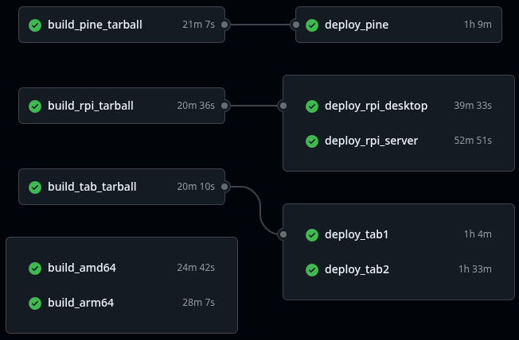

import { Callout } from 'nextra/components'

<Callout emoji="ⓘ">
  **Notice:** This guide assumes familiarity with [manually building images](./intro)
</Callout>

To build an image, simply go to the *Actions* tab of the GitHub repository, run the
`Rhino Linux Image Generation (Meta) [Legacy Workflow]` Action, defined under `legacy.yml` file

After completion, the disk images can be downloaded below the matrix (as pictured above).
